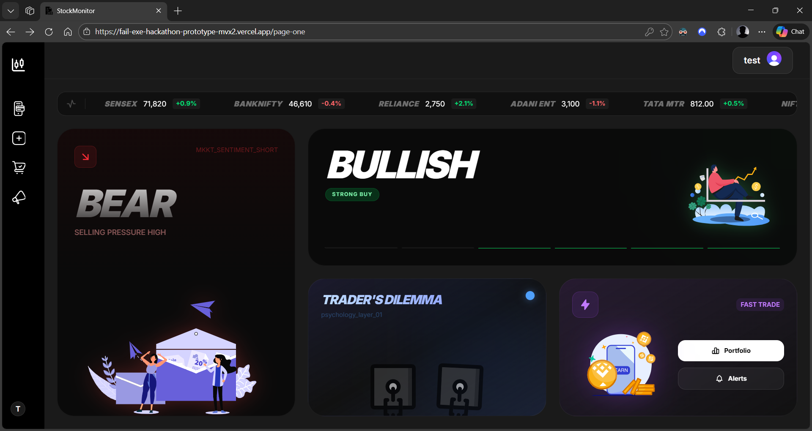
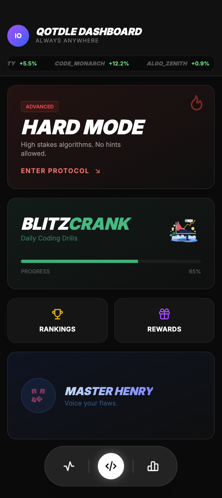
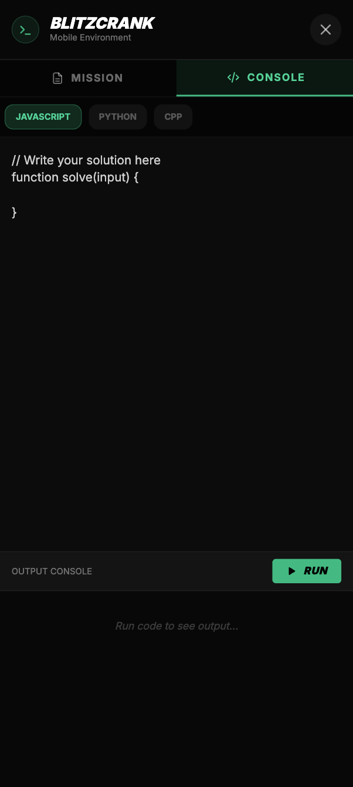
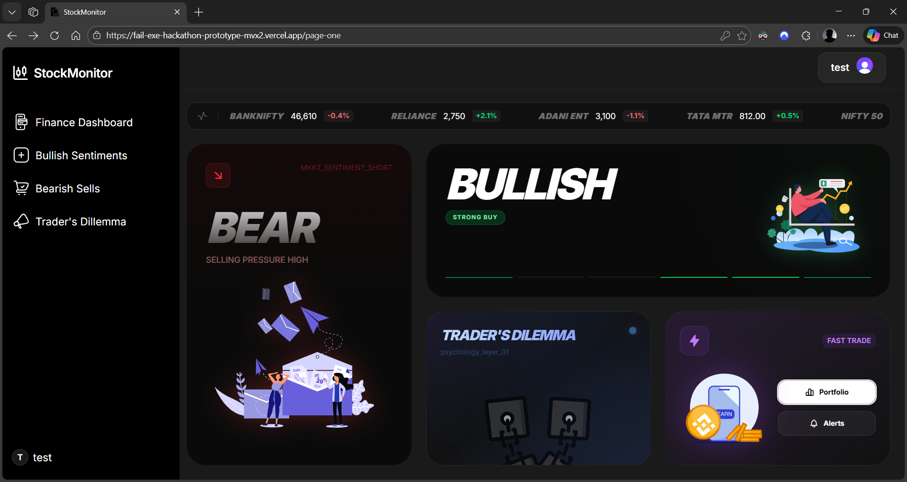
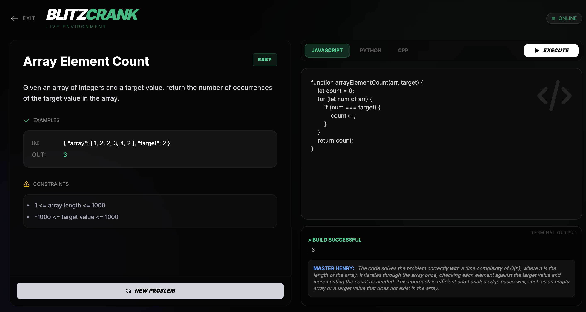
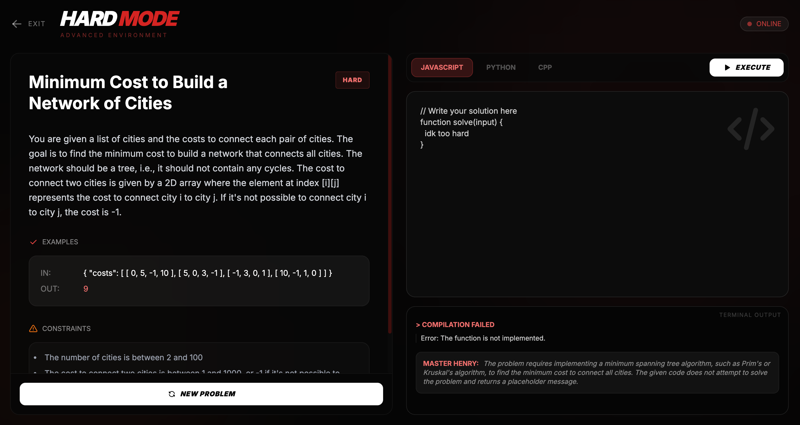

# QODL-E: THE DSA COMBAT TERMINAL

### [🔴 LIVE DEPLOYMENT](https://qotdle-varunsivanesan.vercel.app/) 

**QODL-E** is a high-intensity coding challenge platform engineered for the 18-24 demographic. It transforms daily DSA (Data Structures & Algorithms) practice into an immersive terminal experience, where algorithms meet adrenaline through precision-crafted UI/UX and real-time performance tracking.

---

## EXECUTIVE VISUAL OVERVIEW

### DESKTOP COMMAND CENTER
The central hub designed for maximum information density without cognitive overload.


### RESPONSIVE & MOBILE ARCHITECTURE
Designed for "coding on the commute," the interface fluidly adapts to mobile viewports without losing the terminal aesthetic.

| Responsive Dashboard | Mobile Blitz (Easy) | Mobile Elite (Hard) |
| :---: | :---: | :---: |
|  |  |  |

---

## CORE CAPABILITIES

### 1. DUAL-MODE DIFFICULTY SYSTEM
The platform operates on a two-tier challenge architecture, allowing users to select their challenge based on current skill level and time availability.

#### BLITZCRANK MODE (EASY)
* **Goal:** Quick solves, streak maintenance, and warm-ups.
* **Visual Language:** Emerald Green signals "Safe/Entry Level."
* **Features:** Instant problem fetching, animated success states, and beginner-friendly problem sets.


#### HARD MODE (ELITE PROTOCOL)
* **Goal:** FAANG-level preparation and complex algorithmic combat.
* **Visual Language:** Deep Red signals "High Stakes/Danger."
* **Features:** Graph/DP problem sets, aggressive visual cues, and performance pressure.


### 2. GAMIFIED STATS & LEADERBOARD
To drive the "Daily Habit Formation" requested in the brief:
* **Live Ticker System:** An infinite scrolling leaderboard creates FOMO (Fear Of Missing Out).
* **XP & Streak Tracking:** Visualizes consistency (current streak) and growth (XP gain).
* **Season System:** "Season ends in X days" timers create urgency to participate now.

### 3. "MASTER HENRY" AI MENTORSHIP
* **Role:** Acts as the hint system and code analyzer.
* **Implementation:** Provides real-time feedback on code execution, simulating a 1:1 mentorship experience.

---

## DESIGN PHILOSOPHY & UX DECISIONS

### 1. THEMATIC DEVIATION: WHY "DARK MODE" OVER "MONOTONE BLUE"?
* **The Brief:** Suggested a *monotone blue theme*.
* **The Decision:** I opted for a **Cyberpunk/IDE Dark Theme** with **Blue Accents**.
* **The Rationale:**
    1.  **Target Audience (18-24):** This demographic prefers "Dark Mode" environments (VS Code, Discord, Gaming). A standard white/blue educational site feels like "work," whereas a dark terminal feels like "engineering."
    2.  **Color Semantics:** I utilized **Blue** specifically for "Intelligence" (Master Henry/AI sections) to retain the trust associated with the color, while using Red/Green for game states to drive emotional engagement.

### 2. PSYCHOLOGICAL TRIGGERS FOR RETENTION
* **Terminal Aesthetics = Professional Identity:** The high-contrast UI mimics production-grade tools, making students feel like elite engineers.
* **Ambient Animations = Reduced Anxiety:** Lottie-based liquid animations create a "breathing" interface, reducing the intimidation of a blank code editor.
* **Zero-Friction Start:** The "New Problem" and "Execute" buttons are the most prominent elements, ensuring the user can start coding within seconds of landing.

---

## TECHNICAL ARCHITECTURE

### REPOSITORY STRUCTURE
* **/app:** Next.js 15 App Router with `use client` components for maximum interactivity.
* **/components:** Modular terminal components (CodingTerminal, HardModeTerminal).
* **/public:** Lottie JSON animations and static assets.
* **Backend:** Python-based DSA problem API via Ngrok tunneling.

### THE TECH STACK
| COMPONENT | TECHNOLOGY |
| :--- | :--- |
| **Frontend Framework** | Next.js 15.5.11 (Turbopack) |
| **Animation Engine** | Framer Motion + Lottie-React |
| **Styling** | Tailwind CSS (Glassmorphism/Cyberpunk) |
| **Icons** | Tabler Icons React |
| **Backend** | Python 3.x (FastAPI) |
| **Deployment** | Vercel (Frontend) |

---

## LAYOUT STRATEGY (INFORMATION HIERARCHY)

The dashboard uses a modular grid prioritizing the **F-Pattern** scanning behavior:

1.  **Top Bar (Stats/Leaderboard):** Immediate social proof and activity validation.
2.  **Center-Left (Hard Mode):** Occupies the "Primary Focus" area to signal the core challenge.
3.  **Center-Right (Quick Actions):** Stacked for rapid access to easy mode or secondary features.
4.  **Bottom-Right (Rewards):** Placed in the "Exit" area as a reminder of long-term goals.

---

## HOW THIS PAGE ENCOURAGES DAILY ENGAGEMENT

### IMMEDIATE WINS (DOPAMINE)
- **One-Click Start:** No login walls blocking the immediate view of the problem.
- **Real-Time Execution:** Instant feedback loops (Success/Fail animations) replace boring text output.

### LONG-TERM HOOKS (INVESTMENT)
- **Seasonal Leaderboards:** Creates a "fresh start" effect every few weeks.
- **XP Categories:** Users see progress across specific dimensions (e.g., "Level 5 in Dynamic Programming"), encouraging them to round out their skills.
- **Tangible Rewards:** Visual reminders of prizes (Keyboards, Internships) for top performers.

---

## WHAT I WOULD IMPROVE WITH MORE TIME

### TECHNICAL ENHANCEMENTS
1.  **WebSocket Integration:** Replace current polling with real-time, live-socket leaderboard updates.
2.  **Monaco Editor Integration:** Replace the standard text area with the full VS Code (Monaco) engine for Intellisense and syntax highlighting.
3.  **Test Case Visualization:** A dedicated UI panel to show exactly which hidden test cases failed (Expected vs. Actual output).

### UX REFINEMENTS
1.  **Accessible "Focus Mode":** A toggle to switch the UI to the requested "Monotone Blue/White" High-Contrast theme for users with visual impairments or reading preferences.
2.  **Streak Heatmap:** A GitHub-style contribution graph to visualize daily activity over the year.
3.  **Social Challenges:** A "Challenge a Friend" button to send a specific problem link for a 1v1 speed battle.

---

## ASSETS & CREDITS

Lottie animations created by talented designers:
- [Graphic Room](https://iconscout.com/contributors/graphic-room)
- [Danimotion](https://iconscout.com/contributors/danimotion)
- [Graphichup](https://iconscout.com/contributors/graphichup)

---

## INSTALLATION AND SETUP

```bash
cd javascript-frontend
npm install
npm run dev
